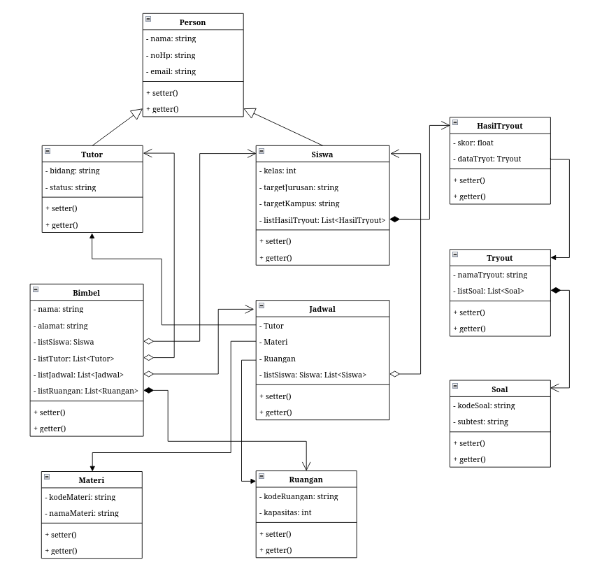
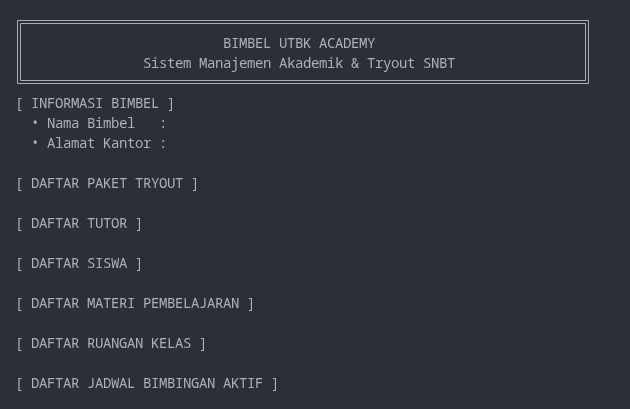
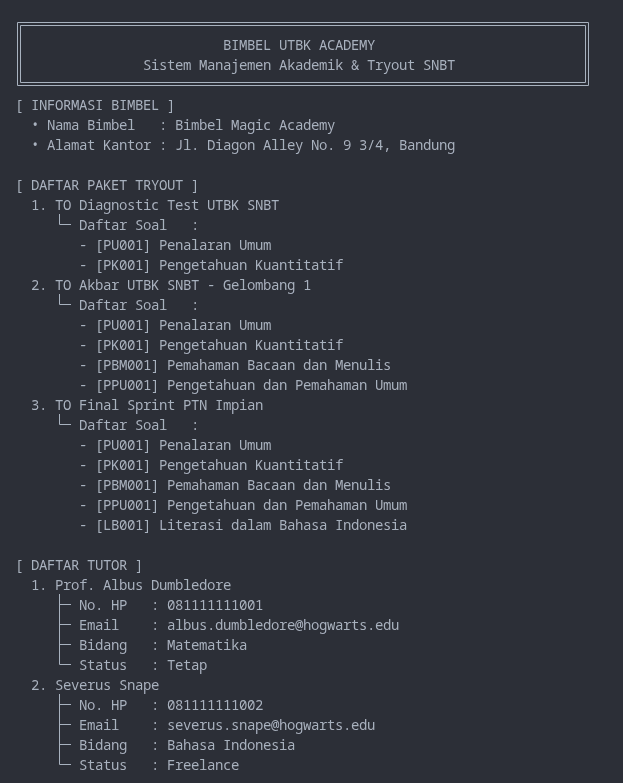
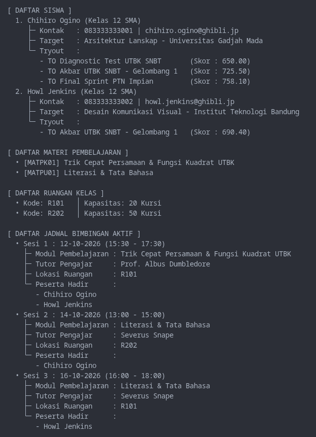
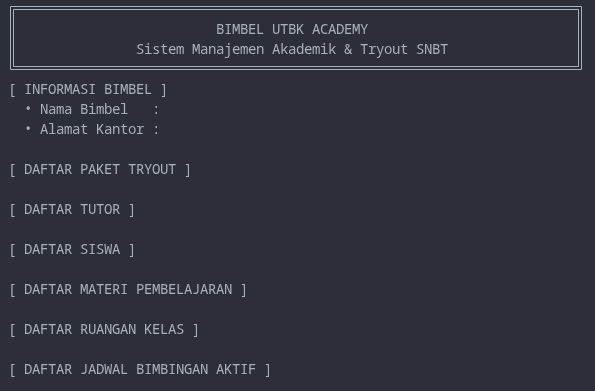
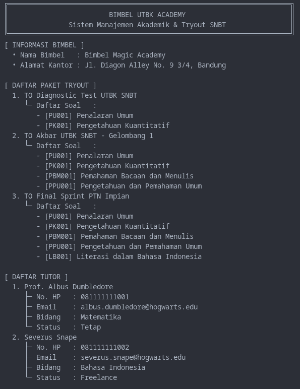
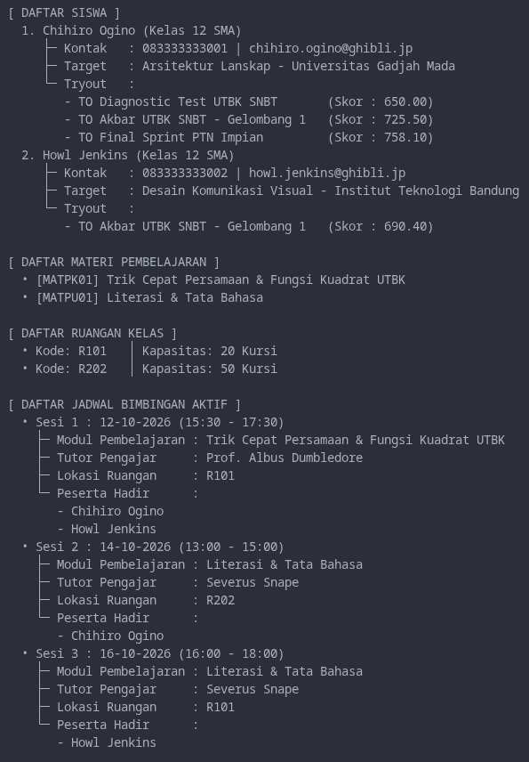
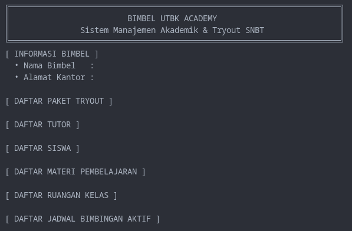
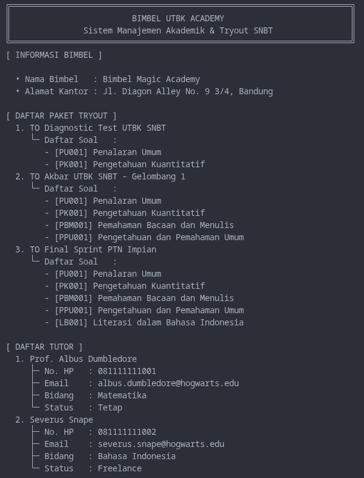
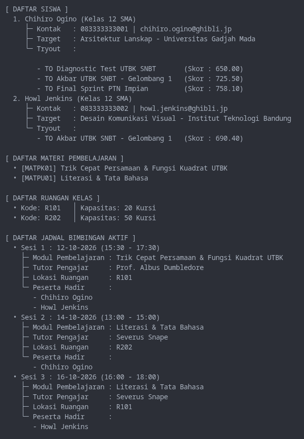

# JANJI
Saya Muhammad Rian Anugrah dengan NIM 2507241 mengerjakan Tugas Praktikum 3 pada Mata Kuliah Desain dan Pemrograman Berorientasi Objek (DPBO) untuk keberkahan-Nya maka saya tidak melakukan kecurangan seperti yang telah dispesifikasikan. Aamiin

# STRUKTUR FOLDER

```text
TP3DPBO2526C2/
├── README.md
├── Diagram.png
│
├── CPP/
│   ├── Dokumentasi/
│   │   ├── before.png
│   │   ├── after1.png
│   │   └── after2.png
│   └── Program/
│       ├── Main.cpp
│       ├── Bimbel.cpp
│       ├── HasilTryout.cpp
│       ├── Jadwal.cpp
│       ├── Materi.cpp
│       ├── Person.cpp
│       ├── Ruangan.cpp
│       ├── Siswa.cpp
│       ├── Soal.cpp
│       ├── Tryout.cpp
│       └── Tutor.cpp
│
├── Java/
│   ├── Dokumentasi/
│   │   ├── before.png
│   │   ├── after1.png
│   │   └── after2.png
│   └── Program/
│       ├── Main.java
│       ├── Bimbel.java
│       ├── HasilTryout.java
│       ├── Jadwal.java
│       ├── Materi.java
│       ├── Person.java
│       ├── Ruangan.java
│       ├── Siswa.java
│       ├── Soal.java
│       ├── Tryout.java
│       └── Tutor.java
│
└── Python/
    ├── Dokumentasi/
    │   ├── before.png
    │   ├── after1.png
    │   └── after2.png
    └── Program/
        ├── Main.py
        ├── Bimbel.py
        ├── HasilTryout.py
        ├── Jadwal.py
        ├── Materi.py
        ├── Person.py
        ├── Ruangan.py
        ├── Siswa.py
        ├── Soal.py
        ├── Tryout.py
        └── Tutor.py
```

# DESIGN

## Referensi Arrows


## Diagram



## Penjelasan

### Implementasi Konsep

Konsep OOP yang dipakai dalam project ini:

- **Inheritance** — class `Tutor` dan `Siswa` mewarisi seluruh atribut dan method dari class `Person`.
- **Hierarchical inheritance** — satu class parent (`Person`) menjadi dasar untuk dua class turunan sekaligus (`Tutor` dan `Siswa`), sehingga atribut umum `nama`, `noHp`, `email` cukup didefinisikan sekali di parent.
- **Composition** — `Siswa` ↔ `HasilTryout`, `Tryout` ↔ `Soal`, dan `Bimbel` ↔ `Materi`/`Ruangan`/`Jadwal`. Objek anak dibuat di dalam class induk, jadi kalau induknya tidak ada, objek anak juga tidak berarti.
- **Aggregation** — `Bimbel` ↔ `Tutor`/`Siswa`, `HasilTryout` ↔ `Tryout`, serta `Jadwal` ↔ `Tutor`/`Materi`/`Ruangan`/`Siswa`. Hubungannya hanya saling mengenal (link) lewat objek yang dirujuk — objeknya dibuat dan dimiliki pihak lain, jadi tetap hidup walau pemilik link-nya tidak ada (belah ketupat kosong pada diagram).
- **Array of object** — kumpulan objek disimpan dalam satu struktur data: `Tutor`, `Siswa`, `Tryout`, `Soal`, `HasilTryout`, `Materi`, `Ruangan`, dan `Jadwal` (`vector<...>` di C++, `List<...>` di Java, `list` di Python).

### Penjelasan Tiap Class

**Class Person**

Class ini merupakan class parent (base class) dari `Tutor` dan `Siswa`. Class ini berisi atribut umum seperti `nama`, `noHp`, dan `email`. Ketiga atribut tersebut bersifat `protected` (di C++ dan Java; di Python memakai konvensi satu underscore `_nama`) karena perlu diakses oleh kelas turunan tanpa harus melalui metode getter. Ini memudahkan kelas turunan untuk menggunakan atribut tersebut, misalnya saat mengisi data lewat constructor `super()` / pemanggilan constructor parent. Method yang tersedia: constructor (kosong dan berparameter) beserta `setNama/getNama`, `setNoHp/getNoHp`, `setEmail/getEmail`.

**Class Tutor**

Class ini merupakan kelas turunan dari `Person` (relasi inheritance sekaligus hierarchical inheritance). Class ini berisi atribut tambahan `bidang` dan `status`. Atribut ini bersifat private untuk melindungi data, jadi hanya bisa dimodifikasi melalui setter (`setBidang`, `setStatus`). Sementara atribut `nama`, `noHp`, `email` diwarisi dari `Person` sehingga tidak perlu didefinisikan ulang.

**Class Siswa**

Class ini merupakan kelas turunan dari `Person` (relasi inheritance sekaligus hierarchical inheritance). Class ini berisi atribut tambahan `kelas`, `targetJurusan`, `targetKampus`, dan `listHasilTryout`. Semua atribut tersebut bersifat private untuk melindungi data, jadi hanya bisa dimodifikasi melalui setter. Untuk atribut `listHasilTryout`, dia merupakan **Composition** dari class `HasilTryout`, alasannya karena `HasilTryout` dan `Siswa` ini merupakan satu kesatuan — skor tryout tidak berarti tanpa siswa yang memilikinya. `HasilTryout` juga dibuat langsung di dalam method `setHasil(skor, dataTryout)`, bukan dari luar.

**Class Bimbel**

Class ini merupakan class utama yang menjadi wadah seluruh data bimbingan belajar. Class ini berisi atribut `nama`, `alamat`, `listSiswa`, `listTutor`, `listMateri`, `listRuangan`, dan `listJadwal`, semuanya private untuk melindungi data, jadi hanya bisa dimodifikasi melalui setter. Relasinya:
- **Aggregation** dengan `Tutor` dan `Siswa` — list siswa/tutor dibuat lalu dimasukkan lewat `setListSiswa()`/`setListTutor()`, jadi objeknya tetap hidup walau `Bimbel` tidak ada.
- **Composition** dengan `Materi`, `Ruangan`, dan `Jadwal` — objeknya dibuat langsung di dalam `Bimbel` lewat `setMateri()`, `setRuangan()`, dan `setJadwal()`, jadi kalau `Bimbel` hilang, materi/ruangan/jadwal itu juga tidak berarti.
- Kelima atribut list tersebut juga merupakan **array of object**.

**Class Materi**

Class ini berisi atribut `kodeMateri` dan `namaMateri`. Atribut ini bersifat private untuk melindungi data, jadi hanya bisa dimodifikasi melalui setter (`setKodeMateri`, `setNamaMateri`). Class ini dimiliki oleh `Bimbel` melalui relasi composition.

**Class Ruangan**

Class ini berisi atribut `kodeRuangan` dan `kapasitas`. Atribut ini bersifat private untuk melindungi data, jadi hanya bisa dimodifikasi melalui setter (`setKodeRuangan`, `setKapasitas`). Class ini dimiliki oleh `Bimbel` melalui relasi composition.

**Class Jadwal**

Class ini berisi atribut `tanggal`, `jamMulai`, `jamSelesai`, `dataTutor`, `dataMateri`, `dataRuangan`, dan `listSiswa`. Semua bersifat private untuk melindungi data, jadi hanya bisa dimodifikasi melalui setter. Class ini memiliki hubungan **Aggregation** dengan `Tutor`, `Materi`, `Ruangan`, dan `Siswa` karena `Jadwal` hanya mengikat (link) objek-objek yang sudah dibuat di pihak lain — bukan membuat atau memilikinya (di C++ direferensikan lewat pointer `Tutor*`, `Materi*`, `Ruangan*`). Artinya tutor/materi/ruangan/peserta tersebut tetap ada walaupun jadwalnya dihapus. `listSiswa` juga array of object berisi peserta sesi, sehingga satu jadwal bisa diikuti banyak siswa dan satu siswa bisa mengikuti banyak jadwal (many-to-many).

**Class Tryout**

Class ini berisi atribut `namaTryout` dan `listSoal`. Atribut ini bersifat private untuk melindungi data, jadi hanya bisa dimodifikasi melalui setter. `listSoal` merupakan **Composition** dengan class `Soal` — objek `Soal` dibuat langsung di dalam method `setSoal(kodeSoal, subtest)`, jadi soal tidak terlepas dari paket tryoutnya. `listSoal` juga merupakan array of object.

**Class Soal**

Class ini berisi atribut `kodeSoal` dan `subtest`. Atribut ini bersifat private untuk melindungi data, jadi hanya bisa dimodifikasi melalui setter (`setKodeSoal`, `setSubtest`).

**Class HasilTryout**

Class ini berisi atribut `skor` dan `dataTryout`. Keduanya bersifat private untuk melindungi data, jadi hanya bisa dimodifikasi melalui setter (`setSkor`, `setTryout`). Class ini memiliki hubungan **Aggregation** dengan class `Tryout` karena `HasilTryout` hanya sekedar menautkan (link) dirinya ke tryout yang diikuti — objek `Tryout` dibuat dan dimiliki pihak lain, jadi tetap ada walau `HasilTryout` tidak ada. Class ini sendiri merupakan bagian dari composition milik class `Siswa` — objeknya dibuat di dalam `Siswa.setHasil()`, sehingga satu siswa bisa memiliki banyak riwayat skor (array of object `listHasilTryout`).

### Alur Program

Program berjalan sebagai aplikasi console (tanpa input), urutannya:

1. **Inisialisasi** — `Main` membuat objek `Bimbel` (`dummyBimbel`) dan list kosong untuk `Tryout`, `Tutor`, dan `Siswa`.
2. **`dataDummy()` — membangun data**
   1. Membuat 3 objek `Tryout`, lalu tiap tryout diisi soal lewat `Tryout.setSoal()` (objek `Soal` dibuat otomatis di dalamnya).
   2. Membuat 2 objek `Tutor` (warisan atribut `nama/noHp/email` dari `Person` + `bidang/status`).
   3. Membuat 2 objek `Siswa` (warisan dari `Person` + `kelas/targetJurusan/targetKampus`), lalu menambahkan riwayat skor lewat `Siswa.setHasil(skor, tryout)` → terbentuk objek `HasilTryout` yang menghubungkan `Siswa` dengan `Tryout`.
   4. `Bimbel` diisi nama & alamat, kemudian list siswa dan tutor dimasukkan (`setListSiswa`, `setListTutor`).
   5. Materi, ruangan, dan jadwal diinstansiasi langsung di dalam `Bimbel` lewat `setMateri()`, `setRuangan()`, dan `setJadwal()` — pada `setJadwal`, objek `Tutor`, `Materi`, `Ruangan`, dan list `Siswa` yang sudah dibuat sebelumnya dirujuk sebagai isi sesi belajar.
3. **`main()` — menampilkan data** (mapping relasi ke output):
   1. Header + informasi bimbel (`Bimbel.getNama()`, `getAlamat()`).
   2. Daftar paket tryout beserta soalnya (loop `Tryout` → loop `getListSoal()`).
   3. Daftar tutor (atribut warisan `Person` + `bidang`/`status`).
   4. Daftar siswa beserta riwayat skor: `Siswa.getListHasilTryout()` → `HasilTryout.getTryout().getNamaTryout()` dan `getSkor()`.
   5. Daftar materi dan ruangan milik `Bimbel`.
   6. Daftar jadwal aktif: tiap `Jadwal` menampilkan materi, tutor, ruangan, dan peserta yang hadir — memperlihatkan seluruh relasi terhubung sekaligus.
4. Program selesai setelah seluruh data tercetak (tidak ada interaksi/input pengguna).

# DOKUMENTASI

## CPP

### Sebelum data dimasukan


### Sebelum data dimasukan
<br>


## Python

### Sebelum data dimasukan


### Sebelum data dimasukan
<br>


## Java

### Sebelum data dimasukan


### Sebelum data dimasukan
<br>

